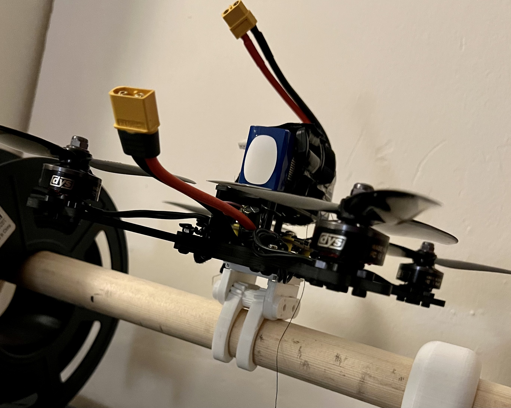

# Biologically Inspired Perching Drone
This project is inspired by the claws of birds of prey and their unique biological ratcheting mechanism that allows them to tightly and securely grip with their talons without relying entirely on muscular strength.

The files within the project contain both the hardware and software required to build a claw attachment for a drone.

## Directory Structure
* [claw_control/](./biologically-inspired-perching-drone/claw_control)  - folder containing firmware
  * [include/](./biologically-inspired-perching-drone/claw_control/include)
  * [lib/](./biologically-inspired-perching-drone/claw_control/lib)
  * [src/](./biologically-inspired-perching-drone/claw_control/src)
  * [test/](./biologically-inspired-perching-drone/claw_control/test)
  * [platformio.ini](./biologically-inspired-perching-drone/claw_control/platformio.ini)
* [hardware/](./biologically-inspired-perching-drone/hardware)          - folder containing hardware (both electronics & CAD)
* [README.md](./biologically-inspired-perching-drone/README.md)

## Hardware
In this folder you can find STL files that can be downloaded for 3D printing and the original parameterised SolidWorks CAD files and assemblies that can be modified to customise/remix the design to suit different drone and hardware configurations. 
* [Bivalve_7_talon/](./biologically-inspired-perching-drone/hardware/Bivalve_7_talon) - folder containing the Solidworks part files and STL files for a version of the bivalve claw mechanism with additional claws (3-4 config).
* [Bivalve_Claw_Mechanism/](./biologically-inspired-perching-drone/hardware/Bivalve_Claw_Mechanism) - folder containing the SolidWorks part files, STL files, and assembly for the bivalve claw mechanism design.
* [Tendon_Arm/](./biologically-inspired-perching-drone/hardware/Tendon_Arm) - folder contianing the STL files used during the testing and development of the tendon claw design.

## Drone Image

## Licenses
Hardware (all files stored under the [hardware](./biologically-inspired-perching-drone/hardware) folder) are under the Creative Commons Attribution-ShareAlike 4.0 International license.

Firmware (all files stored under the [claw_control](./biologically-inspired-perching-drone/claw_control) folder) are under the MIT license.

See each folders LICENSE.txt file for details.
